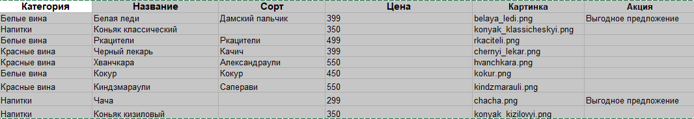

# Новое русское вино

Сайт магазина авторского вина "Новое русское вино".

## Подготовка данных

* Для корректной работы программы необходимо подготовить данные в файле Excel (например, `wine.xlsx`). Ниже представлен пример структуры данных, которые должны быть в таблице:



* Скопируйте структуру таблицы.
* Заполните каждую ячейку соответствующими данными вашей продукции.
* Сохраните файл в формате .xlsx.
* Убедитесь, что названия столбцов в вашем файле Excel точно соответствуют примеру, так как они используются в коде для чтения данных.

* Эта таблица не только показывает, какие данные и в каком формате нужно вводить, но и помогает автоматизировать процесс загрузки данных в программу без дополнительного вмешательства пользователя.

## Запуск

- Скачайте код
- Установите зависимости

```bash
pip install -r reqirements.txt
```

- Запустите сайт командой

```bash
python3 main.py
```

- Создайте файл `.env` и укажите путь к файлу и сам файл. Пример:

```python
WINE_DATA_PATH=wine_data.xlsx
SPECIAL_OFFER_PROMOTION=Выгодное предложение
```

- Перейдите на сайт по адресу [http://127.0.0.1:8000](http://127.0.0.1:8000).

## Цели проекта

Код написан в учебных целях — это урок в курсе по Python и веб-разработке на сайте [Devman](https://dvmn.org).
